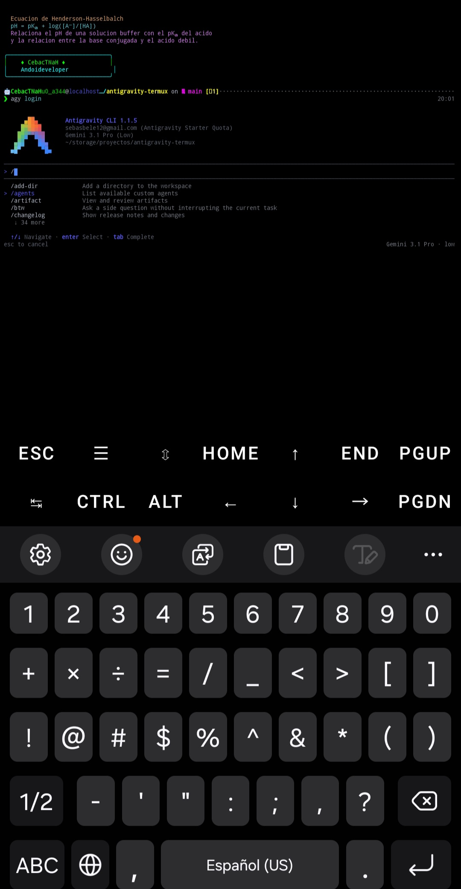
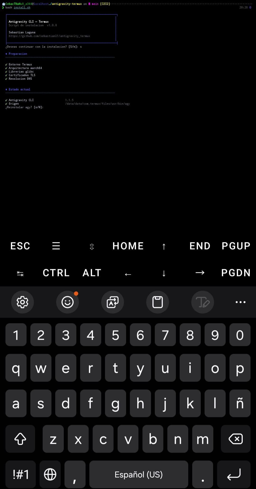

# Antigravity CLI para Termux — Instalación nativa en Android

<p align="center">
  
</p>

<p align="center">
  
</p>

**Instalación nativa de Antigravity CLI (agy) en Termux para Android ARM64 (aarch64).**
Sin proot, sin máquinas virtuales, sin Cloud Shell. Obtén el asistente de IA de Google
funcionando directamente en tu terminal Android.

Este proyecto utiliza el fork comunitario
[wallentx/antigravity-cli-termux](https://github.com/wallentx/antigravity-cli-termux)
que proporciona un bootstrapper compilado para Android/Bionic y un engine glibc
parcheado para funcionar correctamente en Termux.

---

## Guía para principiantes en Termux

¿Es tu primera vez con Termux? Sigue estos pasos antes de instalar Antigravity:

### 1. Instala Termux desde F-Droid

Termux **no debe instalarse desde Google Play** (esa versión está desactualizada y rota).
Instálalo desde el repositorio oficial:

- Descarga **F-Droid**: <https://f-droid.org/>
- Dentro de F-Droid busca **Termux** e instálalo
- También puedes descargar el APK directo: <https://f-droid.org/packages/com.termux/>

### 2. Actualiza los paquetes

Abre Termux y ejecuta:

```bash
pkg update && pkg upgrade -y
```

### 3. Instala las herramientas básicas

Git, curl y tar son necesarios para descargar e instalar Antigravity:

```bash
pkg install git curl tar -y
```

### 4. Verifica tu arquitectura

Antigravity solo funciona en dispositivos **ARM64 (aarch64)**:

```bash
uname -m
```

Debe mostrar `aarch64`. Si muestra `armv7l` o `x86_64`, este instalador no es compatible.

### 5. (Opcional) Da acceso al almacenamiento

Solo si quieres que Termux acceda a tus archivos:

```bash
termux-setup-storage
```

### 6. ¡Listo para instalar Antigravity!

Con Termux actualizado y git instalado, continúa con la sección de
[Instalación](#instalacion) de abajo.

---

## Requisitos

- **Termux** instalado desde [F-Droid](https://f-droid.org/packages/com.termux/)
  (no desde Google Play)
- **Dispositivo Android ARM64** (aarch64)
- **Git, curl y tar** instalados (`pkg install git curl tar -y`)
- **Conexion a internet** para descargar los binarios
- Espacio libre: ~180MB

---

## Instalacion

### Opcion A: Usuario nuevo en Termux

```bash
# 1. Actualizar e instalar dependencias
pkg update && pkg upgrade -y
pkg install git curl tar -y

# 2. Clonar el repositorio
git clone https://github.com/sebastianl1/antigravity-termux.git
cd antigravity-termux

# 3. Ejecutar el instalador
bash install.sh
```

### Opcion B: Ya usas Termux

```bash
git clone https://github.com/sebastianl1/antigravity-termux.git
cd antigravity-termux
bash install.sh
```

El instalador es interactivo y te guiara paso a paso:

1. Verifica el entorno (Termux, arquitectura, dependencias)
2. Descarga e instala los binarios de agy
3. Configura el PATH en tu shell
4. Verifica la instalacion
5. Integra con opencode (opcional)

---

## Que instala

| Componente | Ruta | Descripcion |
|------------|------|-------------|
| `agy` | `$PREFIX/bin/agy` | Bootstrapper nativo Android (~30KB) |
| `agy.va39` | `$PREFIX/bin/agy.va39` | Engine glibc parcheado para Termux (~160MB) |

### Como funciona

El binario `agy` es un bootstrapper compilado nativamente para Android (Bionic libc)
que se encarga de:

- Limpiar variables de entorno que interfieren (`LD_PRELOAD`, `LD_LIBRARY_PATH`)
- Configurar la resolucion DNS correcta para Termux (`GODEBUG=netdns=cgo`)
- Apuntar al almacen de certificados TLS de Termux (`SSL_CERT_FILE`)
- Ejecutar el engine `agy.va39` a traves del loader glibc

Todo esto sin necesidad de `proot`, wrappers ni configuraciones manuales.

---

## Uso

### Iniciar Antigravity CLI

```bash
agy
```

### Verificar version

```bash
agy --version
```

### Autenticar con Google

```bash
agy login
```

Esto abrira tu navegador o mostrara una URL para completar la autenticacion
OAuth con tu cuenta de Google.

### Comandos principales

| Comando | Descripcion |
|---------|-------------|
| `agy` | Iniciar la CLI interactiva |
| `agy login` | Autenticar con Google |
| `agy --version` | Mostrar version |
| `agy update` | Actualizar a la ultima version |

---

## Integracion con opencode

Si tienes [opencode](https://opencode.ai) instalado, el instalador puede
configurar automaticamente el plugin `opencode-antigravity-auth` para que
puedas usar los modelos de Antigravity directamente desde opencode.

### Configuracion manual

Si elegiste no integrar durante la instalacion o si necesitas configurarlo
despues:

1. Ejecuta en tu terminal:
   ```bash
   opencode auth login
   ```
2. Selecciona **Google**
3. Selecciona **OAuth with Google (Antigravity)**
4. Selecciona **"Configure models in opencode.json"**

### Modelos disponibles

| ID | Modelo |
|----|--------|
| `google/antigravity-gemini-3-pro` | Gemini 3 Pro |
| `google/antigravity-gemini-3.1-pro` | Gemini 3.1 Pro |
| `google/antigravity-gemini-3-flash` | Gemini 3 Flash |
| `google/antigravity-claude-sonnet-4-6` | Claude Sonnet 4.6 |
| `google/antigravity-claude-opus-4-6-thinking` | Claude Opus 4.6 Thinking |

### Uso con opencode

```bash
opencode run "Escribe un script en Python" --model google/antigravity-gemini-3-pro
```

---

## Etiquetas y palabras clave

Proyecto orientado a: **Termux**, **Android**, **Antigravity CLI**, **agy**,
**inteligencia artificial**, **asistente de IA en terminal**, **aarch64**,
**ARM64**, **glibc**, **opencode**, **Gemini**, **instalación sin proot**.
Búsquedas frecuentes: "antigravity termux", "instalar antigravity en android",
"agy termux", "antigravity cli android".

---

## Dependencias y resiliencia

El instalador depende de recursos externos de terceros. Para que la herramienta
siga funcionando si alguno desaparece, hay **4 capas de protección**:

| Capa | Qué hace |
|------|----------|
| **Fuente primaria** | Descarga los binarios de `wallentx/antigravity-cli-termux` (versión pinneada, no `latest`) |
| **Mirror propio** | Si wallentx falla, descarga el mismo tarball desde un release de **este repositorio** (`agy-<version>`) |
| **Caché local** | Si las dos anteriores fallan, instala desde `~/.cache/agy/` (se guarda tras la primera instalación) |
| **Verificación SHA256** | Cada tarball se valida contra `versions.json` antes de instalar |

### Qué pasa si wallentx desaparece

- Quienes ya instalaron agy alguna vez: ejecuta `bash install.sh --offline`
  para reinstalar/reparar usando solo la caché local.
- En cualquier caso, el instalador intenta **automáticamente** wallentx → mirror → caché.

### Sincronizar el mirror (cuando salga versión nueva de wallentx)

```bash
bash scripts/mirror.sh          # última versión de wallentx
bash scripts/mirror.sh v1.1.10  # versión concreta
```

Esto descarga, verifica, sube el tarball al release del propio repo y actualiza
`versions.json`. Requiere `gh` autenticado.

---

## Desinstalacion

Para desinstalar agy:

```bash
bash install.sh --uninstall
```

Esto elimina los binarios de `$PREFIX/bin/`. Si tambien quieres eliminar
la configuracion de opencode:

```bash
rm -i ~/.config/opencode/opencode.json
```

Para eliminar los respaldos:

```bash
rm -rf ~/backups/agy.backup.*
```

---

## Estructura del proyecto

```
antigravity-termux/
├── imagenes/
│   └── Antigravity.jpg   # Banner del proyecto
├── docs/                 # Landing page (GitHub Pages) con i18n
│   ├── index.html        # Landing multilingüe (ES, EN, PT, FR, DE, ZH)
│   ├── lang/             # Diccionarios por idioma
│   └── robots.txt, sitemap.xml
├── scripts/
│   └── mirror.sh         # Sincroniza el mirror de binarios (copia de seguridad)
├── versions.json         # Manifest de versiones + SHA256
├── install.sh            # Script de instalacion
├── README.md             # Este archivo
└── LICENSE               # Licencia MIT
```

---

## Autor

**Sebastian Laguna** — Creador y mantenedor del proyecto

---

## Comunidad

- [CONTRIBUTING.md](CONTRIBUTING.md) — Guia para contribuir
- [SECURITY.md](SECURITY.md) — Politica de seguridad
- [CODE_OF_CONDUCT.md](CODE_OF_CONDUCT.md) — Codigo de conducta
- [CHANGELOG.md](CHANGELOG.md) — Historial de versiones

---

## Creditos

- **[wallentx/antigravity-cli-termux](https://github.com/wallentx/antigravity-cli-termux)**
  — Fork comunitario con parches de compatibilidad para Termux (VA39, DNS, TLS)
- **[NoeFabris/opencode-antigravity-auth](https://github.com/NoeFabris/opencode-antigravity-auth)**
  — Plugin de integracion con opencode

---

## Licencia

Este proyecto esta bajo la licencia MIT. Ver el archivo [LICENSE](LICENSE).
